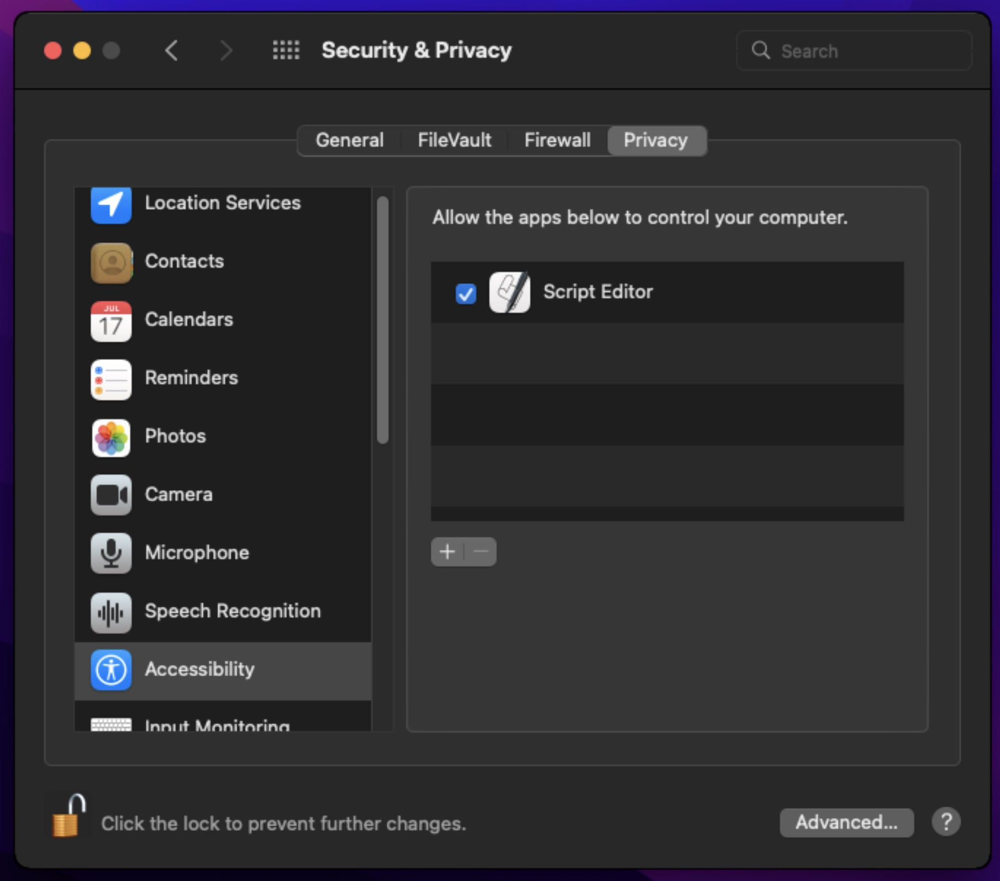
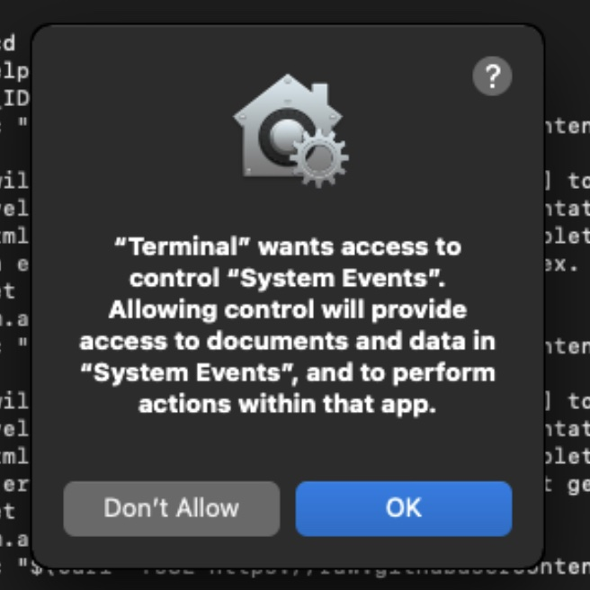

# ds-labs-local-setup

General tools and/or setup scripts

## Getting Started

This repo is open source / public and is intended to provide the setup scripts that don't need authentication to get
started.

If you have a brand new machine, this script will install pip and setup ansible and clone this repo. From that point on the repo/ansible will control your setup.

I encourage you to view [the script](https://raw.githubusercontent.com/DatasiteLabs/ds-labs-local-setup/main/install.sh) in your browser before executing.

### Pre-Requisites

1. Allow permissions for automation

    Due to apple script security model you will need to enable/allow scripting before running. [Full Details](https://developer.apple.com/library/archive/documentation/LanguagesUtilities/Conceptual/MacAutomationScriptingGuide/AutomatetheUserInterface.html)

    1. Launch System Preferences and click Security & Privacy.
    1. Click the Privacy tab.
    1. Click Accessibility.
    1. Click the Add button (+).
    1. Choose an app (`/Applications/Utilities/Terminal`) and click Open.

      

    1. Select the checkbox to the left of the app.
    1. Quit the System Preferences application (`command + q`)

1. Configure a data home directory. Co-locating things makes relative path-ing easier.

    a. Launch a terminal and run the following to use `~/data` as your home for our scripts and code

      ```bash
      mkdir ~/data # can be any dir you want, in your user directory (~)
      cd ~/data # cd into that dir, run code here, the scripts will walk you through
      ```

### Run the Script

  ```bash
  /bin/bash -c "$(curl -fsSL https://raw.githubusercontent.com/DatasiteLabs/ds-labs-local-setup/HEAD/install.sh)"
  ```

  During the script there are a few prompts to setup privileges, follow the instructions. If you see a dialog like the following click 'OK', you may have to re-run the script.

  

## Running Ansible locally

  ```bash
  python3 -m pip install --user -r requirements.txt
  "$(python3 -m site --user-base)"/bin/pre-commit install 
  ```
